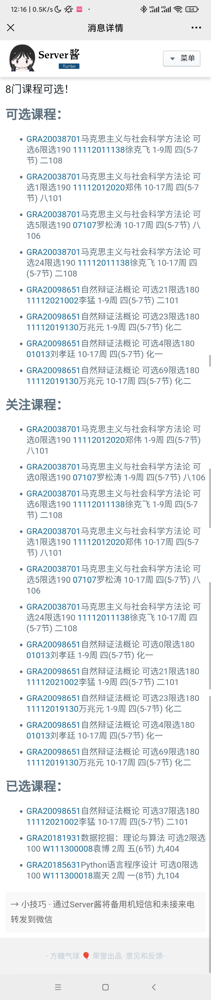

# BNUPublicElectiveCourseMonitor

前排提示：本程序仅用作课程动态提醒以节省浪费在盯屏幕上的时间，**请不要以任何形式影响他人正常选课，不要科技抢课！**

## 简介

监视你感兴趣的BNU公选课程，并将信息推送至手机（微信）

## 使用方法

使用前修改`config.yml`，然后运行`main.py`（测试环境：python 3.8.8）。注意执行程序时请勿科学上网

## 配置`config.yml`

- courses_to_select: 要关注的课程的代码，列表格式
- server_chann_tocken: 你在<a href='https://sct.ftqq.com/'>server-chann</a>中的token，字符串
- stop_when_found: 是否在发现指定课程可选人数>0并推送消息后退出，True或False。如果没有订阅server-chann服务，请务必注意每天5条的消息限制
- courses_to_stop_when_found: 在发现这些课程可选人数>0并推送消息后退出，格式同`courses_to_select`
- refresh_time_sep: 每次查找课程信息之后的等待时间，`float`，单位秒
- number_of_refresh_times: 查找课程的次数，整数（请不要尝试奇怪的数字）

## FAQ

### 关于selenium和geckodriver

程序需要用到`geckodriver`，懒人可以直接去<a>https://github.com/mozilla/geckodriver/releases</a>下载对应版本并解压到项目根目录

### 报`ValueError: check_hostname requires server_hostname`

关梯子，或自行配置代理

### 报`selenium.common.exceptions.StaleElementReferenceException`

请不要动打开的浏览器窗口（登录前一般没事）

### 卡在某个奇怪的地方

本程序只适用于网络情况较好的时候（校园网抽风我也没办法……），某些情况时可以人工辅助操作一下，但请不要在抢课高峰期使用。这个程序可以帮你节省捡漏的时间，但不能帮你抢到课（不过总会有人退选的）

或者请检查你的用户名以及密码是否正确

### 为什么不将用户名和密码存在config里方便使用

我建议你妥善保管你的密码，不要让它明文出现在不该出现的地方。当然如果你喜欢也可以自己改代码实现这个功能

### 其它

自行解决，善用`pip`、`conda`，以及<a href='https://cn.bing.com'>搜索引擎</a>

万般无奈之下请提issue（虽然我也不一定会w

## 推送示例

